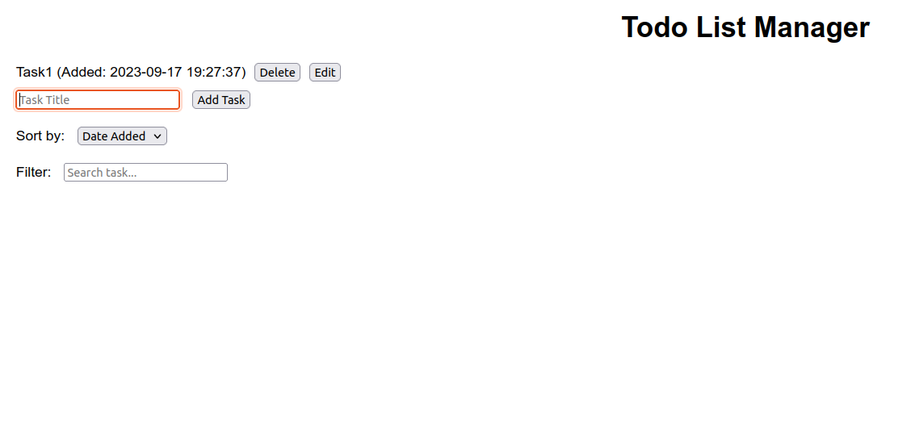
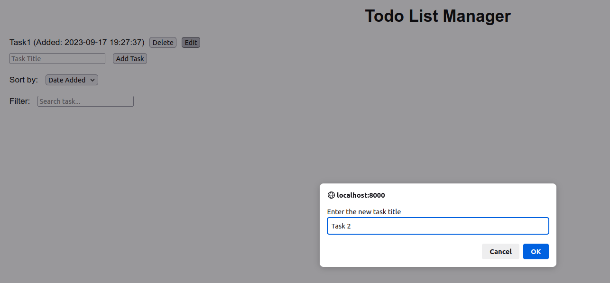
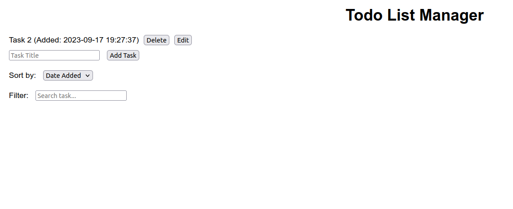
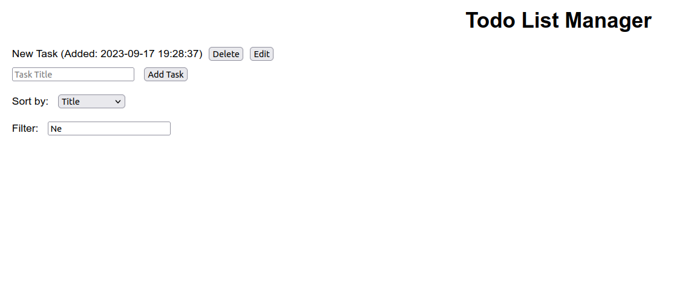
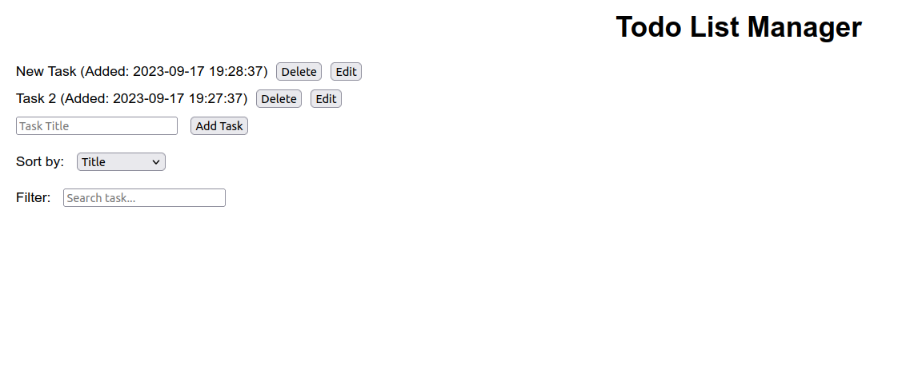

# Todo List Manager

This is a simple Todo List Manager web application with PHP backend and JavaScript frontend. It allows you to add, edit, delete, list, sort, and filter tasks. The tasks are stored in a JSON file on the server.


# Prerequisites and Installation

Before running this application, make sure you have the following installed on your server:

- PHP
- A web server (Apache, Nginx)


To install this application, clone this repository to your server:

```bash
$ git clone Repository_URL
```


# Running the Application
To quickly run this application, you can use PHP's built-in web server:

```bash
$ php -S localhost:8000
```

Then, open your browser and go to http://localhost:8000.


# Backend (backend.php)

The PHP backend script (backend.php) handles the following actions via GET and POST requests:

- action=list: Lists all tasks.
- action=add: Adds a new task.
- action=edit: Edits an existing task.
- action=delete: Deletes a task.
- action=sort: Sorts tasks by date added or title.
- action=filter: Filters tasks by title.

# Frontend (app.js)

The JavaScript frontend script (app.js) handles the interaction with the PHP backend. It uses XMLHttpRequests to make requests to the server and updates the user interface based on the responses.


# Screenshots
- Add a task


- Edit a task


- After editing a task


- filter tasks


- sort tasks by title or due date


